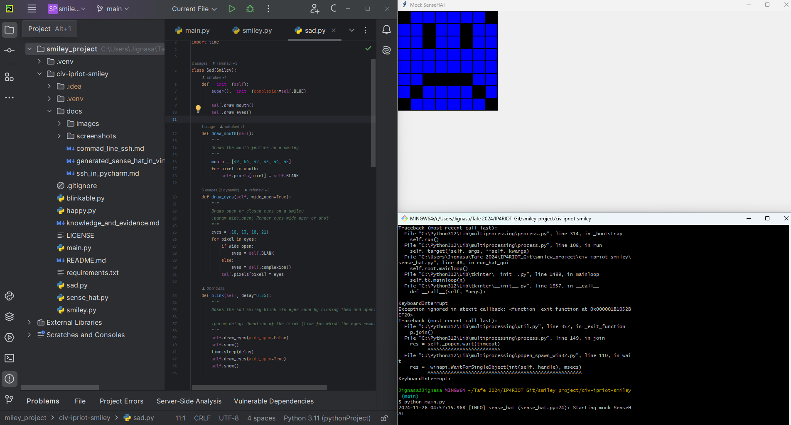
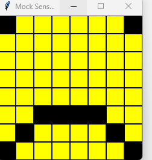
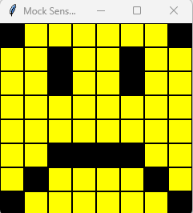
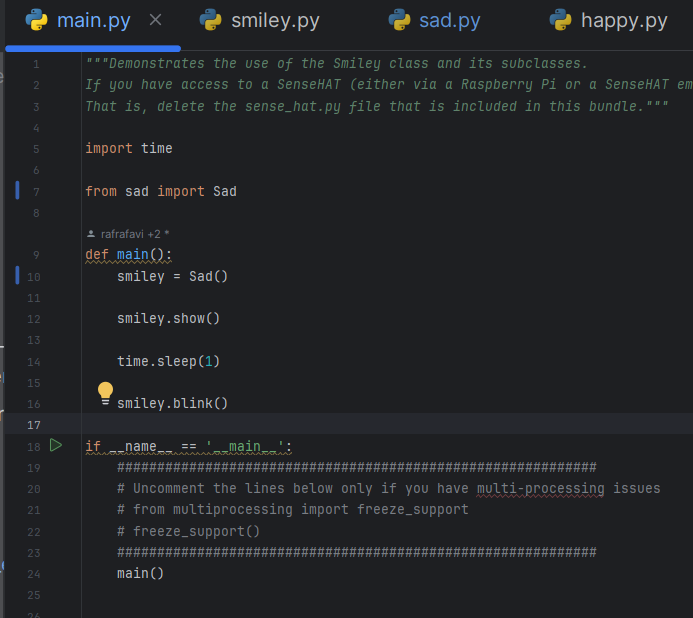
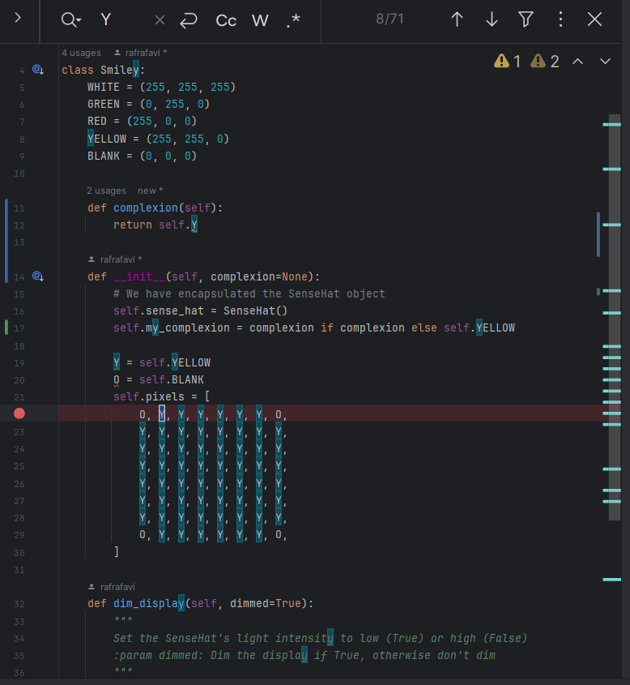

<style>

body {
    counter-reset: h2counter;
}

/* H1 - No numbering */
h1 {
    /* No counter reset or increment */
}

/* H2 - Level 1 numbering */
h2 {
    counter-reset: h3counter;
}

h2::before {
    counter-increment: h2counter;
    content: counter(h2counter) ". ";
}

/* H3 - Level 2 numbering */
h3 {
    counter-reset: h4counter;
}

h3::before {
    counter-increment: h3counter;
    content: counter(h2counter) "." counter(h3counter) " ";
}

/* H4 - Level 3 numbering (optional) */
h4 {
    counter-reset: h5counter;
}

h4::before {
    counter-increment: h4counter;
    content: counter(h2counter) "." counter(h3counter) "." counter(h4counter) " ";
}

</style>

# Evidence and Knowledge

This document includes instructions and knowledge questions that must be completed to receive a *Competent* grade on this portfolio task.

## Required evidence

### Answer all questions in this document

- Each answer should be complete, well-articulated, and within the specified word count limits (if added) for each question.
- Please make sure **all** external sources are properly cited.
- You must **use your own words**. Please include your full chat transcripts if you use generative AI in any way.
- Generative AI hallucinates, is not an authoritative source

### Make all the required modifications to the code

- Please follow the instructions in this document to make the changes needed to the code.

- When requested to upload evidence, upload all screenshots to `screenshots/` and embed them in this document. For example:

```markdown

```

- You must upload the code into your GitHub repository.
- While you can use a branch, your code should be in main when you submit.
- Upload a zip of this repository to Blackboard when you are ready to submit.
- You will be notified of your result via Blackboard
- However, if using GitHub classrooms, you may also receive additional feedback on GitHub directly

### Optional: Use of Raspberry Pi and SenseHat

Raspberry Pi or SenseHat is **optional** for this activity. You can use the included `sense_hat.py` file to simulate the SenseHat on your computer.

If you use a Pi, please **delete** the `sense_hat.py` file.

### Accessible version of the code

This project relies on visual patterns that appear on an LED matrix. If you have any accessibility requirements, you can use the `udl/accessible` branch to complete the project. This branch provides an accessible code version that uses text-based patterns instead of visual ones.

Please discuss this with your lecturer before using that branch.

## Specific Tasks & Questions

Address the following tasks and questions based on the code provided in this repository.

### Set up the project locally

1. Fork this repository (if not using GitHub Classrooms)
2. Clone your repository locally
3. Run the project locally by executing the `main.py` file
4. Evidence this by providing screenshots of the project directory structure and the output of the `main.py` file

 

If you are running on a Raspberry Pi, you can use the following command to run the project and then screenshot the result:

```bash
ls
python3 main.py
```

### Fundamental code comprehension

 Answer each of the following questions **as they relate to that code** supplied by in this repository (ignore `sense_hat.py`):

1. Examine the code for the `smiley.py` file and provide  an example of a variable of each of the following types and their corresponding values (`_` should be replaced with the appropriate values):

   | Type                    | name           | value            |
   | ----------              |----------------|------------------|
   | built-in primitive type | dimmed         | true             |
   | built-in composite type | self.pixels    | A list of tuples |
   | user-defined type       | self.sense_hat | An instance      |

2. Fill in (`_`) the following table based on the code in `smiley.py`:

   | Object                   | Type   |
   | ------------             |--------|
   | self.pixels              | list   |
   | A member of self.pixels  | tuples |
   | self                     | Smiley |

3. Examine the code for `smiley.py`, `sad.py`, and `happy.py`. Give an example of each of the following control structures using an example from **each** of these files. Include the first line and the line range:

   | Control Flow | File      | First line                             | Line range |
   |--------------|-----------|----------------------------------------|------------|
   | sequence     | smiley.py | self.sense_hat.set_pixels(self.pixels) | 39 - 39    |
   | selection    | sad.py    | if wide_open:                          | 26 - 30    |
   | iteration    | happy.py  | for pixel in mouth:                    | 21 - 22    |

4. Though everything in Python is an object, it is sometimes said to have four "primitive" types. Examining the three files `smiley.py`, `sad.py`, and `happy.py`, identify which of the following types are used in any of these files, and give an example of each (use an example from the code, if applicable, otherwise provide an example of your own):

   | Type                    | Used? | Example     |
   | ----------------------- |-------|-------------|
   | int                     | Yes   | 255         |
   | float                   | Yes   | 0.25        |
   | str                     | No    | "Hello World" |
   | bool                    | Yes   | True        |

5. Examining `smiley.py`, provide an example of a class variable and an instance variable (attribute). Explain **why** one is defined as a class variable and the other as an instance variable.

> **Class Variable**: _example_ - `WHITE = (255, 255, 255)`
>                 _Explanation_:- Class variables represents the constant value and its same for all instances of the class.
> **Instance variable**: _example_ - `self.pixels` _Explanation_:- Instance variable are specific to an instance of the class.                               
>

6. Examine `happy.py`, and identify the constructor (initializer) for the `Happy` class:
   1. What is the purpose of a constructor (in general) and this one (in particular)?

   >     def __init__(self):
        super().__init__()

        self.draw_mouth()
        self.draw_eyes()
   > The constructor for the happy.py class is the _init_ method. 
   > _purpose of constructor (In general)_-- A constructor initialize the attributes of an instance when its created. It 
   > provides a way to assign values or initialize behaviour during object creation making sure the instance is ready to use.
   > _purpose of constructor (in particular)_-- In Happy class, [super().__init__()]() initialize attributes and methods
   > from the parent class `Smiley` making sure the base structure is created. `self.draw_mouth()`
 `self.draw_eyes()` are called to create smiley's mouth and eyes. By modifying `self.pixels` gives happy expression 
   > which is inherited from  `Smiley ` class to the generic smiley. 

   2. What statement(s) does it execute (consider the `super` call), and what is the result?

   > `super().__init__()` calls the constructor of the parent class(Smiley), which initialize and set up the attributes
   > with a generic pixel pattern of smiley with an instance.
   > 
   >

### Code style

1. What code style is used in the code? Is it likely to be the same as the code style used in the SenseHat? Give to reasons as to why/why not:
   
> PEP 8 code style is used in the code. Yes, it is likely to be the same as the code style used in the SenseHat. 
> SenseHat is python based and designed for educational purpose. Having PEP 8 style SenseHat integrates seamlessly
> with `Smiley` project code here. 

2. List three aspects of this convention you see applied in the code.

> 1. PascalCase naming convention. 
> 2. Docstrings 
> 3. Indentation and Whitespace


3. Give two examples of organizational documentation in the code.

* > 1.Class level and method level docstring 
* > 2.self-descriptive variable and method naming

### Identifying and understanding classes

> Note: Ignore the `sense_hat.py` file when answering the questions below

1. List all the classes you identified in the project. Indicate which classes are base classes and which are subclasses. For subclasses, identify all direct base classes.
  
  Use the following table for your answers:

| Class Name | Super or Sub? | Direct parent(s)  |
|------------|---------------|-------------------|
| Smiley     | Super         | --                |
| Sad        | Sub           | Smiley            |
| Happy      | Sub           | Smiley, Blinkable |
| Blinkable  | Super         | None              |
| SenseHat   | Super         | None              |


2. Explain the concept of abstraction, giving an example from the project (note "implementing an ABC" is **not** in itself an example of abstraction). (Max 150 words)

> Abstraction is concept where complex details of system are hidden while exposing only the necessary and 
> relevant features. In our project Smiley class is an abstraction concept. It defines how a smiley face and its 
> expressions are created and displayed, but we don't need to know exactly how it manipulates individual pixels on the 
> screen. We just call high-level methods like `show()` to see the smiley face.   
>
>

3. What is the name of the process of deriving from base classes? What is its purpose in this project? (Max 150 words)

> The process of deriving from base class called inheritance. Inheritance allows the subclass to acquire the attributes
> and methods from a super(parent)class promoting code reuse.  In the project , the `Sad` and `Happy` classes inherit from the `Smiley` 
> class (a parent class) which allows to derive the common properties and methods (like `draw_mouth()` and `drew_eye()`)
> but also define their own behaviour such as expression for `Sad` and blinking feature for `Happy`. By using inheritance, 
> the project avoids using the same code like for drawing smiley face. This makes the code easier to mange and update.    
>

### Compare and contrast classes

Compare and contrast the classes Happy and Sad.

1. What is the key difference between the two classes?

 
| **Sad class**                       | **Happy class**                              |
|-------------------------------------|----------------------------------------------|
| Represents sad smiley face.         | Represents Happy smiley face.                |
| Eyes drawn but no blinking feature. | Eyes blink using `Bklinkable` class.         |
| Has only 1 parent class `Smiley`.   | Has 2 parent class `Smiley` and `Blinkable`. |
| Form a sad (curved downward) mouth. | Form a smiling (curved upward) mouth.        |

   
What are the key similarities?
   > Both class `Happy` and `Sad` are,
*    Inherit from the `Smiley` parent class
*    represents the emotional expression
*    represents features like eyes and mouth
*    using loops to draw mouth and eyes according to their emotion expression.
*    use the pre-defined colours from `Smiley` class
*    encapsulate the complexity of drawing the smiley by providing methods for constructing specific features.

What difference stands out the most to you and why?
   > The blinkable features of `Happy` class stands out the most. It makes happy smiley more dynamic. Its interaction with user makes it more 
   > lively, while `Sad` class is purely static representation of a sad expression. This difference highlights the 
   > flexibility of object-oriented programming. 
   > 
How does this difference affect the functionality of these classes
   > The blinking functionality makes Happy more visually appealing and suited for dynamic interfaces, while the static 
   > nature of Sad makes it more straightforward and appropriate for conveying a specific, non-interactive mood. This 
   > difference emphasizes their distinct roles in representing emotions.
   >

### Where is the Sense(Hat) in the code?

1. Which class(es) utilize the functionality of the SenseHat?
   > All three `Smiley`, `Sad` and `Happy` classes utilize the functionality of the SenseHat. 
   >
2. Which of these classes directly interact with the SenseHat functionalities?
   > The `Smiley` class directly interact with the `SenseHat` functionalities.
   >
   3. Discuss the hiding of the SenseHAT in terms of encapsulation (100-200 Words)
   >    Encapsulation  is one of the fundamental concepts of object-oriented programing that involves the idea of wrapping
   > data and the methods that work on data within one unit(class). This puts restrictions on accessing variables and methods
   > directly and can prevent the accidental modification of data. In the smiley project, SenseHat's hidden functionality
   > is evidence of encapsulation. The `sense_hat` object is only used within the class itself. If someone wants to 
   > display a smiley or dim the lights, they just call methods like `show()` or `dim_display()`. They don’t need to
   > know anything about how the SenseHat works or mess with it directly. This makes the Smiley class safer to use. 
   > Users can’t accidentally change something in the SenseHat that might break the program. The Smiley class handles 
   > all the tricky parts of working with the SenseHat, while users just call simple methods to get what they need done.
   > This keeps the program clean and easier to understand.
   >

### Sad Smileys Can’t Blink (Or Can They?)

Unlike the `Happy` smiley, the current implementation of the `Sad` smiley does not possess the ability to blink. Let's first explore how blinking has been implemented in the Happy Smiley by examining the blink() method, which takes one argument that determines the duration of the blink.

**Understanding Blink Mechanism:**

1. Does the code's author believe that every `Smiley` should be able to blink? Explain.

> Looks like code author don't believe that every Smiley should be able to blink. If the code author have thought about 
> making every Smiley blink then `Blinkable` class would have been imported to `Smiley` (parent) class, so all sub class 
> could inherit it.  
>

2. For those smileys that blink, does the author expect them to blink in the same way? Explain.

> Yes, for smileys that blink, the author likely expects them to blink in the same way, based on the implementation of 
> the `blink()` method and the use of the `Blinkable` class. Also, the code does not provide additional argument or 
> methods for customising the blinking style. This indicates that all smileys are expected to blink same way. 
>

3. Referring to the implementation of blink in the Happy and Sad Smiley classes, give a brief explanation of what polymorphism is.

> Polymorphism is a programming concept where different classes can have their own version of a method, but we can call 
> that method on any object, and it will behave correctly based on the object’s class. In the case of `Happy` and `Sad`
> smiley classes, `Happy` class has a `blink()` method, that makes the smiley blink. It changes the state of the eyes 
> and includes a delay to make the blink happen. In `Sad` class doesn't have blink method, so sad smileys don't blink by
> default. If we try to call blink() on a sad smiley, it won't do anything because that method doesn't exist for sad 
> smileys. 
>

4. How is inheritance used in the blink method, and why is it important for polymorphism?

> Inheritance allows `Happy` class to get all the attributes and method defines in `Smiley` (parent) class. If `Smiley` 
> had a `blink()` method  the `Happy` class would inherit it but `Happy` class adds its own `blink()` method to be 
> specific to how happy smiley blinks. 
> This is important for polymorphism, as it lets different classes implement the same method in their own way. This way, 
> we can call `blink()` on any smiley object, but it will behave differently depending on the specific class (like `Happy` or `Sad`).
>
1. **Implement Blink in Sad Class:**

   - Create a new method called `blink` within the Sad class. Ensure you use the same method signature as in the Happy class:

   ```python
   def blink(self, delay=0.25):
       """
        Blinks the sad smiley's eyes once
        
        :param delay: Delay between blinks (in seconds)
        """
        self.draw_eyes(wide_open=False)
        self.show()  
        time.sleep(delay)  
        self.draw_eyes(wide_open=True)  
        self.show()  
   ```

2. **Code Implementation:** Implement the code that allows the Sad smiley to blink. Use the implementation from the Happy Smiley as a reference. Ensure your new method functions similarly by controlling the blink duration through the `delay` argument.
 
3. **Testing the Implementation:**

- Test the new blink functionality on your Raspberry Pi or within the Python classes provided. You might need to adjust the `main.py` script to incorporate Sad Smiley's new blinking capability.

Include a screenshot of the sad smiley or the modified `main.py`:





- Observe and document the Sad smiley as it blinks its eyes. Describe any adjustments or issues encountered during implementation.

 While adjusting the code in Main.py, the import lines at the top of the code were collapsed, so I did not see that I 
 also has to change `from sad import Sad` , so my smiley didn't run and gitbash gave me an error , as I ran the command 
 without looking at code, which draw my attention to change from Happy to sad for this `from sad import Sad`  line of code. 

  ### If It Walks Like a Duck…

  Previously, you implemented the blink functionality for the Sad smiley without utilizing the class `Blinkable`. Assuming you did not use `Blinkable` (even if you actually did), consider how the Sad smiley could blink similarly to the Happy smiley without this specific class.

  1. **Class Type Analysis:** What kind of class is `Blinkable`? Inspect its superclass for clues about its classification.

     > The `Blinkable` class is an abstract class.It defines methods like blink() that are meant to be implemented or 
  overridden by `Sad` subclasses. It provides a blueprint for functionality, allowing subclasses to customize the behavior while ensuring consistency in the method structure.

  2. **Class Implementation:** `Blinkable` is a class intended to be implemented by other classes. What generic term describes this kind of class, which is designed for implementation by others? **Clue**: Notice the lack of any concrete implementation and the naming convention.

  > The generic term that describes this kind of class is an interface. In Python,classes like Blinkable are designed to serve as interfaces when they lack concrete implementation and provide a blueprint for other classes to implement specific methods, such as blink().

  3. **OO Principle Identification:** Regarding your answer to question (2), which Object-Oriented (OO) principle does this represent? Choose from the following and justify your answer in 1-2 sentences: Abstraction, Polymorphism, Inheritance, Encapsulation.

  > The OO principle represented here is Abstraction.This is because Blinkable defines an interface or blueprint (e.g., the blink() method) 
  > without providing a concrete implementation, allowing subclasses to implement the specific methods while focusing on the general idea of blinking.  

  4. **Implementation Flexibility:** Explain why you could grant the Sad Smiley a blinking feature similar to the Happy Smiley's implementation, even without directly using `Blinkable`.

  > The Sad Smiley can have a blinking feature by directly defining a blink() method in its class, duplicating the Happy
  > Smiley's logic. 
  
  5. **Concept and Language Specificity:** In relation to your response to question (4), what is this capability known as, and why is it feasible in Python and many other dynamically typed languages but not in most statically typed programming languages like C#? **Clue** This concept is hinted at in the title of this section.

  > This capability is known as duck typing, where an object's compatibility is determined by the presence of methods 
  > and properties rather than its actual type. It is possible in dynamically typed languages like Python because type
  > checks happens as the code run while statically typed languages like C# require strict type 
  > definitions.

  ***

  ## Refactoring

  ### Does a Smiley Have to Be Yellow?

  While our current implementation predominantly features yellow smileys, emotional expressions like sickness or anger typically utilize colors like green, red, or orange. We'll explore the feasibility of integrating these colors into our smileys.

  1. **Defined Colors and Their Location:**

     1. Which colors are defined and in which class(s)?
        > White, green, red ,yellow and blank colours are defined and all are in `Smiley` class.
     2. What type of variables hold these colors? Are the values expected to change during the program's execution? Explain your answer.
        > Class variables hold these colours. Values aren't expected to change during the program execution because its 
     serving as constants, making sure of consistent behavior across all instances.

        3. Add the color blue to the appropriate class using the appropriate format and values.
         > Add into class `Smiley` with other colours and in Constant format like BLUE = (0,0,255)
            
  2. **Usage of Color Variables:**

     1. In which classes are the color variables used?
        > Colours variables are used in `Smiley`, `Sad` and `Happy` class.

  3. **Simple Method to Change Colors:**
  4. What is the easiest way you can think to change the smileys to green? Easiest, not necessarily the best!
     > The easiest way to change the smileys to green is to update the class variable for the color (e.g. self.YELLOW) 
  in the base Smiley class to green values. 

  Here's a revised version of the "Flexible Colors – Step 1" section for the smiley project, incorporating your specifications for formatting and content updates:

  ### Flexible Colors – Step 1

  Changing the color of the smileys once is straightforward, but it isn't very flexible. To facilitate various colors for smileys, it is advisable not to hardcode values in any class. This approach was identified earlier as a necessary change. Let's start by removing the built-in assumptions about color in our classes.

  1. **Add a method called `complexion` to the `Smiley` class:** Implement this instance method to return `self.YELLOW`. Using the term "complexion" instead of "color" provides a more abstract terminology that focuses on the meaning rather than implementation.

  2. **Refactor subclasses to use the `complexion` method:** Modify any subclass that directly accesses the color variable to instead utilize the new `complexion` method. This ensures that color handling is centralized and can be easily modified in the future.

  3. **Determine the applicable Object-Oriented principle:** Consider whether Abstraction, Polymorphism, Inheritance, or Encapsulation best applies to the modifications made in this step.

  4. **Verify the implementation:** Ensure that the modifications function as expected. The smileys should still display in yellow, confirming that the new method correctly replaces the direct color references.

  This step is crucial for setting up a more flexible system for color management in the smiley display logic, allowing for easy adjustments and extensions in the future.

  ### Flexible Colors – Step 2

  Having removed the hardcoded color values, we now enhance the base class to support dynamic color assignments more effectively.

  1. **Modify the `__init__()` method in the `Smiley` class:** Introduce a default argument named `complexion` and assign `YELLOW` as its default value. This allows the instantiation of smileys with customizable colors.

  2. **Introduce a new instance variable:** Create a variable called `my_complexion` and assign the `complexion` parameter to it. This step ensures that each smiley instance can maintain its own color state.

  3. **Rationale for `my_complexion`:** Using a distinct instance variable like `my_complexion` avoids potential conflicts with the method parameter names and clarifies that it is an attribute specific to the object.

  4. **Bulk rename:** We want to update our grid to use the value of complexion, but we have so many `Y`'s in the grid. Use your IDE's refactoring tool to rename all instances of the **symbol** `Y` to `X`. Where `X` is the value of the `complexion` variable. Include a screenshot evidencing you have found the correct refactor tool and the changes made.

  


  5. **Update the `complexion` method:** Adjust this method to return `self.my_complexion`, ensuring that whatever color is assigned during instantiation is what the smiley displays.

  6. **Verification:** Run the updated code to confirm that Smileys still defaults to yellow unless specified otherwise.

  ### Flexible Colors – Step 3

  With the foundational changes in place, it's now possible to implement varied smiley colors for different emotional expressions.

  1. **Adjust the `Sad` class initialization:** In the `Sad` class's initializer method, change the superclass call to include the `complexion` argument with the value `self.BLUE`, as shown:

     ```python
     super().__init__(complexion=self.BLUE)
     ```

  2. **Test color functionality for the Sad smiley:** Execute the program to verify that the Sad smiley now appears blue.

  3. **Ensure the Happy smiley remains yellow:** Confirm that changes to the Sad smiley do not affect the default color of the Happy smiley, which should still display in yellow.

  4. **Design and Implement An Angry Smiley:** Create an Angry smiley class that inherits from the `Smiley` class. Set the color of the Angry smiley to red by passing `self.RED` as the `complexion` argument in the superclass call.

  ***
